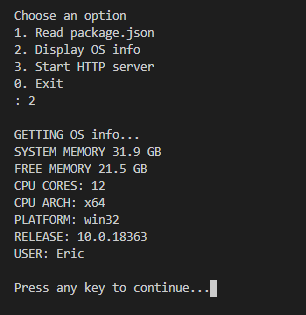

# Experis-ConsoleApp-NodeJS
This is a very simple console application made in NodeJS according to [instructions](/Instructions.pdf).
It can print the contents of a file (package.json), print system info, and start a webserver with a single endpoint on port 8080 (visit http://localhost:8080 in a browser window when started).

# Requirements to run
* [NodeJS](https://nodejs.org/)

# How to run
Navigate to the root folder in a terminal. Type "node app.js" to start the program
